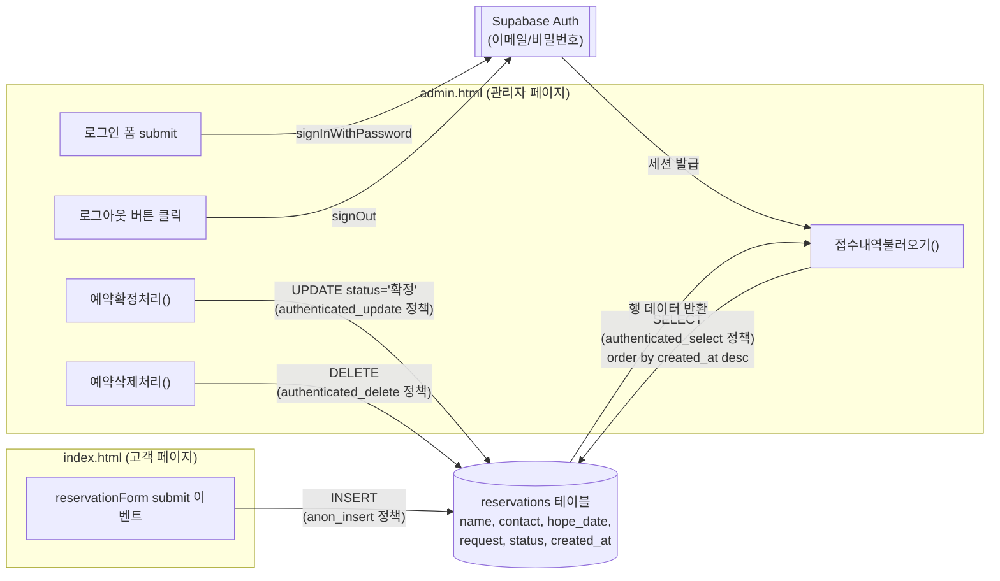
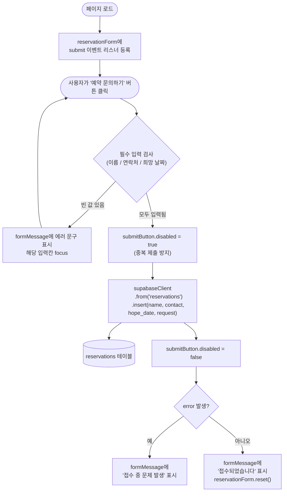
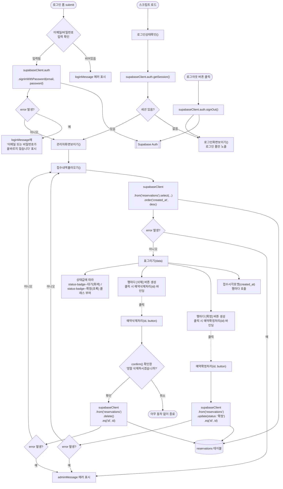

# 주말 독서 토론 참가 관리 서비스 — 전체 흐름도

이 문서는 `index.html`(고객 페이지)과 `admin.html`(관리자 페이지) 두 파일의
함수 단위 호출 관계와, Supabase `reservations` 테이블을 통한 데이터 이동을 정리한 것입니다.

- 두 파일은 서로 직접 호출하지 않고, 같은 Supabase 프로젝트의 `reservations` 테이블을 통해서만 연결됩니다.
- `index.html`은 anon(비로그인) 권한으로 INSERT만 가능합니다.
- `admin.html`은 로그인(authenticated) 후에만 SELECT/UPDATE/DELETE가 가능합니다.

---

## 1. 전체 아키텍처 (파일 ↔ Supabase 데이터 흐름)

---

## 2. index.html — 고객 예약 문의 흐름

---

## 3. admin.html — 관리자 로그인 · 접수 관리 흐름

---

## 4. 함수 목록 요약

### index.html
| 함수/핸들러 | 호출하는 대상 | 데이터 이동 |
|---|---|---|
| `reservationForm` submit 리스너 (익명 함수) | `supabaseClient.from('reservations').insert()` | 폼 입력값 → `reservations` 테이블 (INSERT) |

### admin.html
| 함수 | 호출하는 대상 | 호출되는 시점 |
|---|---|---|
| `로그인상태확인()` | `supabaseClient.auth.getSession()`, `관리자화면보이기()`, `로그인화면보이기()` | 스크립트 최초 로드 시 |
| `로그인화면보이기()` | (DOM 조작만) | 세션 없음 / 로그아웃 시 |
| `관리자화면보이기()` | `접수내역불러오기()` | 세션 있음 / 로그인 성공 시 |
| `loginForm` submit 리스너 | `supabaseClient.auth.signInWithPassword()`, `관리자화면보이기()` | 로그인 버튼 클릭 시 |
| `logoutButton` click 리스너 | `supabaseClient.auth.signOut()`, `로그인화면보이기()` | 로그아웃 버튼 클릭 시 |
| `접수내역불러오기()` | `supabaseClient.from('reservations').select().order()`, `표그리기()` | 관리자 화면 진입 시 / 확정·삭제 후 |
| `표그리기(reservations)` | `접수시각포맷()`, 각 행의 `예약확정처리()` / `예약삭제처리()` 바인딩 | 접수 내역 조회 성공 시 |
| `접수시각포맷(isoString)` | (순수 변환 함수, Date → 문자열) | `표그리기()`에서 행마다 호출 |
| `예약확정처리(id, button)` | `supabaseClient.from('reservations').update().eq()`, `접수내역불러오기()` | [확정] 버튼 클릭 시 |
| `예약삭제처리(id, button)` | `confirm()`, `supabaseClient.from('reservations').delete().eq()`, `접수내역불러오기()` | [삭제] 버튼 클릭 시 |
